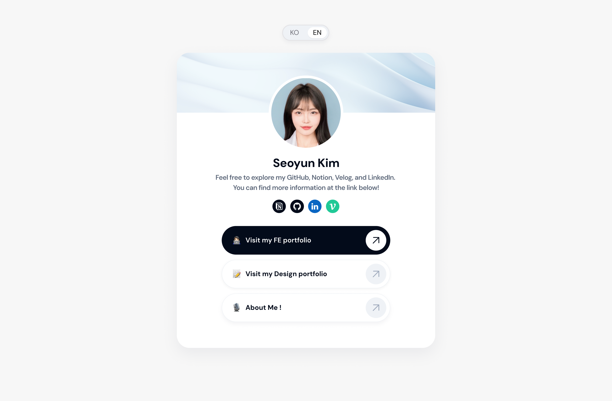

</br>
</br>
</br>
 
<h1 align="center" style="font-weight: bold;">📂 폴더 구조</h1>

```
┣ 📦src
┣ 📂app
┃ ┣ 📂store
┃ ┃ ┗ 📜useLanguageStore.ts
┃ ┣ 📂ui
┃ ┃ ┗ 📜IconCheck.tsx
┃ ┣ 📜globals.css
┃ ┣ 📜layout.tsx
┃ ┗ 📜page.tsx
┗ 📂components
   ┗ 📜AboutModal.tsx
```

</br>
</br>
</br>

 <h1 align="center" style="font-weight: bold;">🛠 Trouble Shooting

[](https://velog.io/@gimmari/트러블슈팅)

</h1>

</br>
</br>
</br>

<h1 align="center" style="font-weight: bold;">📋 Languages</h1>

<div align="center" style="display: flex; flex-direction: row; align-items: center; justify-content: center;">


</div>

</br>
</br>

<h1 align="center" style="font-weight: bold;">📚 Frameworks, Libraries</h1>

<div align="center" style="display: flex; flex-direction: row; align-items: center; justify-content: center;">


</div>
</br>
</br>

<h1 align="center" style="font-weight: bold;">🎨 Design</h1>

<div align="center">


</br>

<h1 align="center" style="font-weight: bold;">☁️ Hosting</h1>

<div align="center">


</div>
